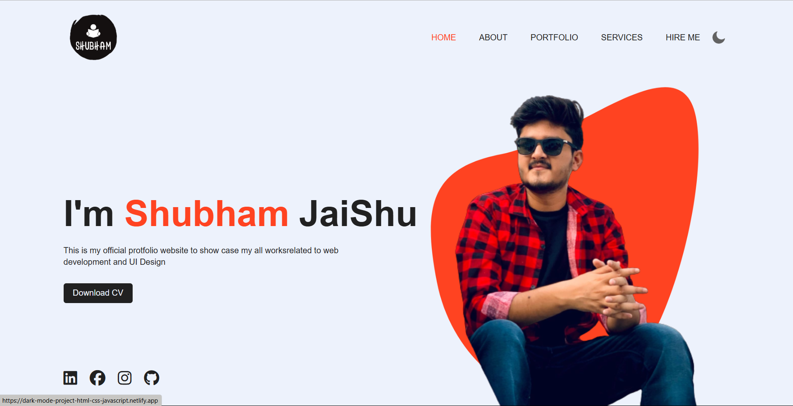

# Dark Mode Website

A simple website demonstrating dark mode implementation using HTML, CSS, and JavaScript.

[Live Demo](https://dark-mode-project-html-css-javascript.netlify.app/)

---

## Overview
This project showcases:
- Toggleable dark and light modes.
- Smooth transitions between modes for better user experience.
- Simple and responsive design adaptable to all screen sizes.

---

## Features
- **Dark/Light Mode Toggle:** Switch between themes with a single click.
- **Smooth Transitions:** CSS animations for a seamless switch.
- **Responsive Design:** Optimized for desktops, tablets, and mobile devices.

---

## Technologies Used

### Frontend
- **HTML5:** Structured content.
- **CSS3:** Styling and responsive design.
- **JavaScript:** Adds interactivity for toggling modes.

### Hosting
- Hosted on Netlify: [Live Demo](https://dark-mode-project-html-css-javascript.netlify.app/)

---

## Installation

### Steps
1. Clone the repository:
   ```bash
   git clone https://github.com/your-username/dark-mode-website.git
   ```

2. Navigate to the project directory:
   ```bash
   cd dark-mode-website
   ```

3. Open the `index.html` file in your browser:
   ```bash
   open index.html
   ```

---

## How It Works
1. **Theme Toggle:** A button toggles between dark and light themes.
2. **Dynamic Styling:** JavaScript dynamically switches styles based on the selected mode.
3. **Responsive Layout:** CSS ensures compatibility across devices.

---

## Preview



---

## Future Improvements
- Save user preferences for dark mode using local storage.
- Add more theme options for customization.
- Include animations for enhanced user interaction.

---

## Contribution
Contributions are welcome! Feel free to fork the repository and submit a pull request.

---

## Contact
For queries or feedback, please contact [Shubham](mailto:shubhamjaishu@gmail.com).
